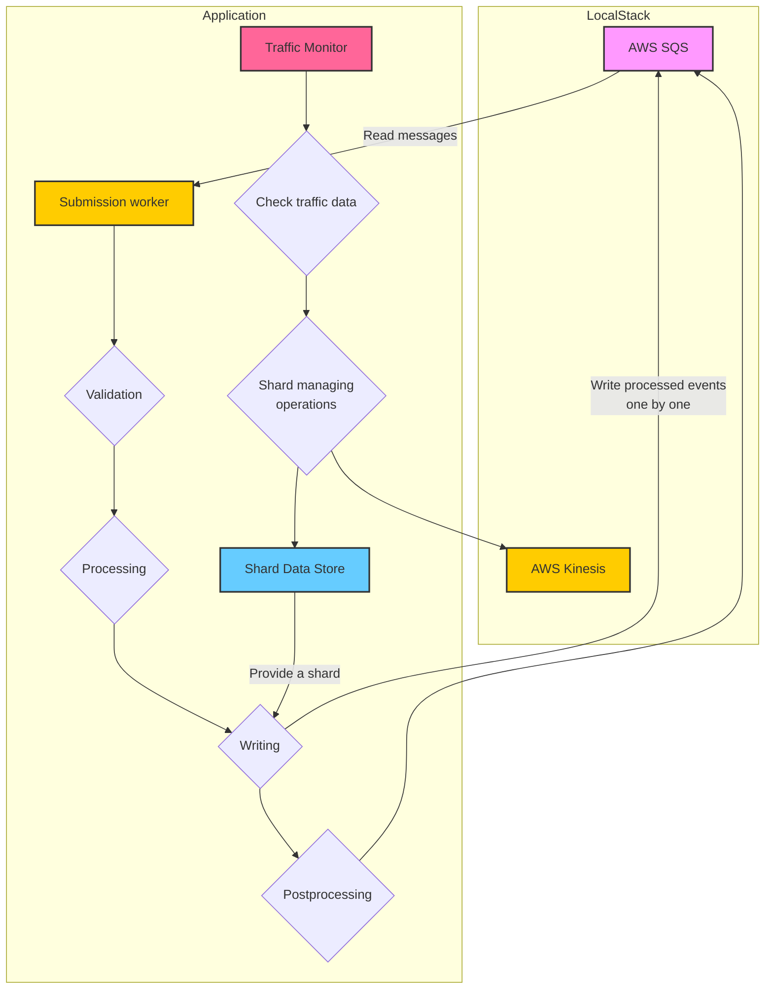

# 1. Introduction
## 1.1 Purpose

This document provides a comprehensive overview of the architecture of the Telemetry Processor command-line tool. Documentation is aimed at guiding the user through design decisions and technical details.

## 1.2 Scope

The architecture encompasses the entire telemetry data pipeline, including data ingestion from SQS, real-time processing, and data publishing to Kinesis.

## 1.3 Overview

Telemetry Processor reads data from AWS SQS, validates the data, processes it, and writes it to Kinesis.

# 2. Components

The application operates through three main modules:

- **SubmissionWorkers** (one or more instances)
- A single **TrafficMonitor**
- A single **ShardDataStore**

## 2.1 SubmissionWorkers

SubmissionWorkers are responsible for reading, processing, and writing data within the application. They continuously read messages from the SQS queue, validate the data, and handle writing to Kinesis. Additionally, SubmissionWorkers request new shards from the ShardDataStore and send records of shard traffic and any encountered errors back to it.

## 2.2 TrafficMonitor

The TrafficMonitor runs in the background alongside the SubmissionWorkers. Its primary role is to manage shard metric data within the ShardDataStore. It monitors traffic patterns and initiates shard splitting and merging operations with Kinesis to optimize performance based on current workload.

## ## 2.3 ShardDataStore

The **ShardDataStore** acts as a shared resource, maintaining traffic data for each shard used during the application's runtime. Access is managed via a `RwLock` from the `tokio` library to ensure thread safety, allowing only one instance to write to the `ShardDataStore` at any given time while permitting up to four instances to read concurrently.

### 2.31 Structure and Functionality

The `ShardDataStore` contains a vector of **ShardMetrics** objects, each corresponding to an actual shard in Kinesis. Each **ShardMetric** includes the following fields:

- **Shard Identifier**: The unique identifier of the corresponding shard in Kinesis.
- **Starting Hash Key**: The starting hash key for the shard.
- **Ending Hash Key**: The ending hash key for the shard.
- **Average Data Processed**: The average amount of data processed over the TrafficMonitor's observation period.
- **Recent Throughput Errors**: The count of throughput errors encountered during the TrafficMonitor's observation period.
- **ShardMetric Entries**: A vector of **ShardMetricEntry** objects that track events related to the shard.
- **Active Submissions**: A vector of identifiers for submissions currently being written to the shard.
- **Activity State**: Indicates whether the shard is active or inactive.

### 2.32 ShardMetricEntry

Each **ShardMetricEntry** object records an event related to its parent **ShardMetric**. It includes:

- **Timestamp**: The time at which the event occurred.
- **Data Processed**: The amount of data processed during the event, if applicable.
- **Records Written**: The number of records written during the event, if applicable.
- **Throughput Errors**: The number of throughput errors encountered during the event, if applicable.
# 3. Application Process Overview

## Application Process Overview

The application's process consists of two concurrently running loops:

- **SubmissionWorkers' Loops**
- **TrafficMonitor's Loop**

## 3.1 SubmissionWorker Loop

### 3.11 Data Reading

The **SubmissionWorkers** start with a single instance that continuously reads messages from a designated SQS queue. The number of messages retrieved per request and the requested visibility timeout are defined in the application's configuration file (`Config.toml`). Upon a successful read, the SubmissionWorker spawns an asynchronous task using Rust's `tokio` library for each message returned, creating a clone of itself to handle processing and writing. This design enables multiple **SubmissionWorker** instances to process different messages concurrently.

### 3.12 Data Processing

In the processing phase, the SubmissionWorker validates the read data against a designated JSON schema using the `jsonschema` library's `validate()` function. If the message is invalid, the SubmissionWorker deletes the original message from the SQS queue and halts further processing.

For valid messages, the SubmissionWorker iterates through the embedded events, encapsulating each event in an **EventWrapper** struct. This struct includes the original event, a unique identifier, the submission identifier from the message, an order number, a timestamp for its original creation, and a processing timestamp. The submission identifier and order numbers ensure the events' order within the same submission, even after writing.

After processing, the SubmissionWorker requests the most suitable shard from the `SharedDataStore` instance and prepares to write each event. It calls its `write()` function for each event, collecting their futures in a vector. Once all write operations conclude, it checks for any failures. If any operation fails, it sets the visibility timeout of the current message in SQS to 0, making it available for other workers. If all write operations succeed, the SubmissionWorker deletes the original message from the SQS queue.

### 3.13 Data Writing

The writing process begins by converting the event into a **Blob** object required by Kinesis. The first write attempt is initiated. Upon success, the SubmissionWorker records the written data in the `SharedDataStore`, along with a timestamp, attaching it to the corresponding **ShardMetric** object for the current shard. This record includes the number of bytes written and the count of records.

In case of a failure, the SubmissionWorker assesses the error type. If it encounters a `PutRecordError::ProvisionedThroughputExceededException`, it indicates that the target shard has reached its writing limit. The SubmissionWorker logs this error in the `SharedDataStore` and records it in the corresponding **ShardMetric**.

Next, the SubmissionWorker requests the shard with the best health, determined by the average writing capacity over a configurable time period and the current load from SubmissionWorkers. After receiving a shard, it checks for remaining retry attempts as defined in the application's configuration file (`Config.toml`). If no retries remain, the `write()` function returns an error. If retries are available, the SubmissionWorker waits for a designated period before retrying, doubling the wait time with each attempt to allow for congestion to ease.

## 3.2 TrafficMonitor Loop

### 3.21 Update ShardDataStore

The **TrafficMonitor** begins by fetching all shards from the designated Kinesis stream and creating **ShardMetric** items in the `SharedDataStore` for each available shard. This serves as an initialization of the `SharedDataStore` data.

### 3.22 Traffic monitoring and managing

Following initialization, the main loop commences. At each interval specified in the configuration, the TrafficMonitor iterates through each **ShardMetric** entry in the `SharedDataStore`, acquiring a write lock for the duration of its operation to prevent data changes by SubmissionWorkers.

For each **ShardMetric**, the TrafficMonitor first clears entries older than the configurable entry lifetime. It then checks the activity status of the **ShardMetric**. For inactive shards, it moves on to the next entry. For active shards, it calculates the average data written to the corresponding shard during a configurable observation period and the total number of throughput errors that occurred. It then compares these results against configured threshold values. If a shard experiences excessive throughput errors or has a high average usage capacity, the TrafficMonitor orders its splitting. Conversely, if a shard shows few throughput errors and maintains low average usage, it is added as a candidate for merging.

### 3.23 Shard Splitting

For shard splitting, the TrafficMonitor calculates the midpoint of the current shard's hash key and sets it as the new starting point for the hash key of a new shard. It makes the appropriate call to Kinesis, and upon success, it updates the **ShardMetric** in the `SharedDataStore`, similar to the initial setup.

### 3.24 Shard Merging

If there are two or more candidates for shard merging, the TrafficMonitor checks their adjacency by comparing the end and start points of their hash keys. It also verifies the activity status to account for any potential changes during the merging operation. If the shards are both active and adjacent, merging is initiated with Kinesis. Upon successful merging, the **ShardMetric** in the `SharedDataStore` is updated accordingly.
